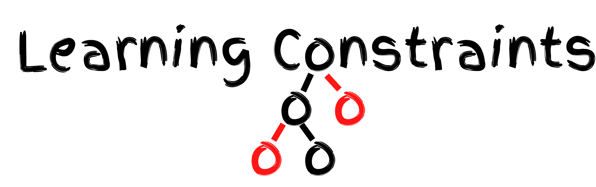

<p align="center"></p>

---

Implementation of Chunking experiments in our ACL 2020 paper. Learning Constraints for Structured Prediction Using Rectifier Networks
```
@inproceedings{pan2020constraintlearning,
      author    = {Pan, Xingyuan and Mehta, Maitrey and Srikumar, Vivek},
      title     = {{Learning Constraints for Structured Prediction Using Rectifier Networks}},
      booktitle = {Proceedings of the 58th Annual Meeting of the Association for Computational Linguistics},
      year      = {2020}
  }
```
This folder contains the experiments relating to chunking mentioned in the paper "Learning Constraints for Structured Prediction Using Rectifier Networks" to appear at the 2020 Annual Conference of the Association for Computational Linguistics.

After cloning the directory-
```bash
cd scripts
```

### Data Files-
 train_new.txt - Train file with tab seperated words and tags
 dev_new.txt   - Dev file with tab seperated words and tags
 test_new.txt  - Test file with tab seperated words and tags
 label_map.json- Universal mapping of chunk tags to integers


## Requiremets-
```bash
pip install -r requirements.txt
```
You need to download GloVe file to the directory this cane be done by-
```bash
wget http://nlp.stanford.edu/data/glove.840B.300d.zip -P ./../data/
```
then
```bash
unzip ./../data/glove\*.zip -d ./../data/
```


## Preprocess- 
No explicit preprocessing required. 
**Note:** Processed data files are formed during the first run of the program for each training ratio and reused for anny subsequent experiments. Due to this the first run might take some additional time.


## Train Base Models-
```bash
python3 run_bilstmcrf_glove.py \
		 --ratio 0.01 \
		 --mode "train" \
		 --save_enable "y" 
```
Every model will be stored along with the JSON which contains dev accuracy and test_accuracy. These accuracies are determined by Viterbi Decode. Early stopping enables the prgram to stop if no improvements for 10 consecutive epochs. Models will be saved in models_glove directory.

### Constraint choices variables - 
1) N-gram Label existence
2) Part of Speech tags

## Train Constraints-
```bash
python3 run_constraint_learning.py --ratio 0.01 --ngram 3  --choice 2 --save_enable 1 --lr 0.001 --save_dir "./../constraint_models_2/"
```
Code will be save under the save_dir. Every model which shows improvement on dev accuracy will be stored along with the JSON which contains dev accuracy and test_accuracy.


## Test-
```bash
python3 run_bilstmcrf_glove.py  --choice 2 \
		                --ngram 4 \
		                --ratio 1 \
		                --mode "test" \
		                --model_dir "./../models_glove/1/27_0.9549602724177072" \
		         	--constraint_model_dir "./../constraint_models_2/choice_2/ngram_4/ratio_1.0/736_0.9435263687311395" \
				--beam 10 \
				--allow_constraint 1 \
				--hidden_rect 10
```


## Checklist
- [x] Test runs
- [ ] Add other experiments
